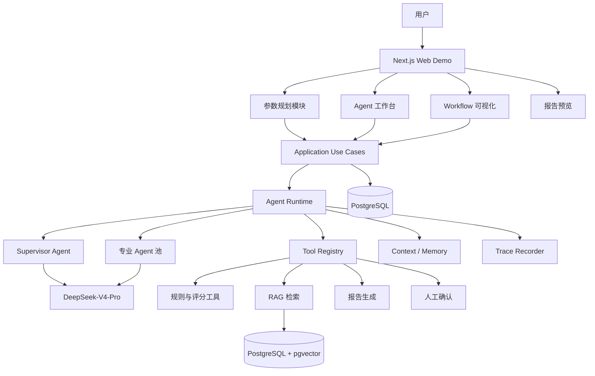

# 爆擎 BlastForge

> **AI 原生爆破工程辅助决策与协同平台**

爆擎 BlastForge 面向爆破工程领域，将工程参数规划、专业知识检索、多 Agent 协同、风险复核和报告生成整合为一套可执行、可解释、可追踪的智能工作流。

当前仓库主要用于构建一套面向模拟商业会议展示的高完成度 Demo。项目不仅强调功能闭环，也强调现代化视觉设计、丰富动画交互、数据可视化和规范化代码结构。

---

## 项目定位

BlastForge 不是普通聊天机器人，也不是传统 CRUD 后台。

它希望展示的是一套完整的 AI 工程辅助执行体系：

```text
工程条件输入
    ↓
参数标准化
    ↓
知识库检索
    ↓
爆破参数预测与方案规划
    ↓
多方案生成与评分
    ↓
安全复核
    ↓
人工确认
    ↓
报告生成与归档
```

当前阶段重点验证：

- 爆破工程参数预测与规划；
- DeepSeek-V4-Pro 模型接入；
- 多 Agent 协同；
- Agentic Workflow；
- RAG 知识检索与引用；
- Tool Calling；
- Human-in-the-loop 人工复核；
- 高完成度商业展示体验。

---

## 核心展示能力

### 智能参数规划

根据工程类型、岩体条件、水文条件、环境约束、成本倾向和自然语言补充信息，生成：

- 参数标准化结果；
- 参数建议值或建议区间；
- 推荐方案；
- 备选方案；
- 风险方案；
- 多维评分；
- 参数敏感性分析；
- 人工重点确认清单。

### Agent 工作台

平台将不同职责拆分为多个专业 Agent：

- Supervisor Agent；
- Input Normalizer Agent；
- Knowledge Retriever Agent；
- Parameter Planner Agent；
- Scheme Generator Agent；
- Evaluation Agent；
- Safety Reviewer Agent；
- Report Agent。

每个 Agent 都具备明确的输入、输出、工具权限、模型模式和执行边界。

### Agentic Workflow

系统通过可视化工作流展示任务执行过程：

```text
用户输入
  → 参数标准化
  → 场景识别
  → 知识检索
  → 参数规划
  → 方案生成
  → 评分计算
  → 安全复核
  → 人工确认
  → 报告生成
```

每个节点可查看：

- 当前状态；
- Agent 输入；
- Agent 输出；
- Tool 调用；
- 知识引用；
- 执行耗时；
- 风险与错误；
- 人工审批状态。

### RAG 知识库

知识库用于整合：

- 爆破工程课程资料；
- 炸药性能说明；
- 安全规范摘要；
- 教学案例；
- 脱敏工程案例；
- 项目规则和产品资料。

重要结论需要关联具体来源，避免只展示无法验证的模型生成结果。

### 方案对比与可视化

平台使用现代化可视化手段展示：

- 多方案雷达图；
- 参数对比柱状图；
- 参数变化趋势；
- 敏感性热力图；
- 风险分布；
- Agent 阶段耗时；
- 工作流节点关系；
- 知识引用关系。

### 报告生成

系统可基于最终确认结果生成结构化报告，包括：

- 工程条件摘要；
- 参数预测与规划结果；
- 推荐及备选方案；
- 多维评分；
- 风险提示；
- 知识引用；
- Agent 执行摘要；
- 人工复核意见。

---

## Demo 页面规划

| 页面 | 主要职责 |
|---|---|
| 品牌展示首页 | 展示产品定位、核心能力和动态 Agent 网络 |
| 智能驾驶舱 | 展示项目、运行任务、风险和 Agent 状态 |
| 参数规划工作台 | 录入参数、执行预测、查看 Agent 过程 |
| 方案对比中心 | 对比推荐、备选和风险方案 |
| Agent 工作台 | 查看 Agent 池、工具、Schema 和运行历史 |
| Workflow 视图 | 可视化展示 Agentic Workflow 执行过程 |
| 知识依据视图 | 查看文档来源、命中片段和引用关系 |
| 报告预览 | 预览并导出最终报告 |

---

## 技术栈

### 核心框架

- Next.js App Router
- React
- TypeScript
- pnpm Workspace
- Turborepo

### UI 与交互

- Tailwind CSS
- shadcn/ui
- Radix UI
- Motion
- GSAP，可选
- Lucide React

### 数据可视化

- Apache ECharts
- React Flow
- TanStack Table

### 状态与表单

- TanStack Query
- Zustand
- React Hook Form
- Zod

### 数据与持久化

- PostgreSQL
- pgvector
- Drizzle ORM

### AI 与 Agent

- AI SDK
- `@ai-sdk/deepseek`
- DeepSeek-V4-Pro
- Agent Runtime
- Tool Registry
- Workflow Engine
- Trace Recorder

### 工程化

- Vitest
- Playwright
- Biome
- Sentry
- Docker

---

## 系统架构



---

## Agent Runtime

Agent Runtime 是项目的核心展示能力之一。

```text
Agent Runtime
├─ Orchestrator
├─ Agent Registry
├─ Workflow Engine
├─ Tool Registry
├─ Context Builder
├─ Memory Store
├─ Guardrails
├─ Human Approval
└─ Trace Recorder
```

每个 Agent 必须声明：

```ts
interface AgentDefinition<TInput, TOutput> {
  id: string
  name: string
  description: string
  model: string
  mode: 'thinking' | 'non-thinking'
  inputSchema: ZodType<TInput>
  outputSchema: ZodType<TOutput>
  tools: string[]
  maxSteps: number
  timeoutMs: number
  systemPromptVersion: string
  requiresApproval: boolean
}
```

---

## Tool Calling

首期计划提供以下工具：

```text
normalize_engineering_parameters
search_knowledge
run_rule_check
calculate_scheme_score
analyze_parameter_sensitivity
compare_schemes
build_report_outline
request_human_approval
```

工具设计原则：

- 输入输出必须经过 Zod 校验；
- 工具调用必须具备唯一 ID；
- 计算类工具优先使用确定性代码；
- 高风险写操作必须经过人工批准；
- 工具结果必须可追踪、可重放；
- 禁止模型调用任意 SQL、Shell 或现场控制指令。

---

## 项目目录

```text
BlastForge/
├─ apps/
│  └─ web/                         # Next.js 全栈 Demo
│
├─ packages/
│  ├─ ui/                          # 设计系统
│  ├─ db/                          # Drizzle Schema 与查询
│  ├─ contracts/                   # Zod、DTO、事件契约
│  ├─ agent-core/                  # Agent Runtime
│  ├─ agent-tools/                 # Tool 定义与实现
│  ├─ knowledge/                   # RAG 与引用处理
│  └─ config/                      # 公共工程配置
│
├─ docs/
│  ├─ product/
│  ├─ architecture/
│  ├─ database/
│  ├─ demo-script/
│  └─ adr/
│
├─ design/
│  ├─ wireframes/
│  ├─ visual/
│  └─ prototypes/
│
├─ assets/
│  ├─ brand/
│  ├─ images/
│  ├─ demo-data/
│  └─ knowledge/
│
├─ scripts/
├─ docker/
├─ pnpm-workspace.yaml
├─ turbo.json
└─ biome.json
```

---

## 本地开发

> Phase 1 阶段仅完成视觉与骨架。本仓库使用 **npm**（仓库已锁定 `package-lock.json`），暂未启用 pnpm Workspace / Turborepo / 数据库。后续阶段将按设计规范在合理时机引入。

### 环境要求

- Node.js 22+
- npm 10+

PostgreSQL、pnpm Workspace、Turborepo、Docker 暂不在 Phase 1 范围内。

### 安装依赖

```bash
npm install
```

### 配置环境变量

复制环境变量示例：

```bash
cp .env.example .env.local
```

Windows PowerShell：

```powershell
Copy-Item .env.example .env.local
```

Phase 1 阶段仅需要两个公开变量（见 [`.env.example`](.env.example)）：

```dotenv
NEXT_PUBLIC_APP_NAME=BlastForge
NEXT_PUBLIC_DEMO_MODE=true
```

禁止将任何真实密钥提交到仓库；后续阶段的服务端密钥将由专门的 Server-Side 环境变量承载，不会出现在 `NEXT_PUBLIC_*` 中。

### 启动开发环境

```bash
npm run dev
```

默认访问：

```text
http://localhost:3000
```

可访问的主路由：

```text
/                  品牌首页
/dashboard         总览（智能驾驶舱）
/planner           参数规划
/agents            Agent 工作台
/workflow          Workflow 视图
/knowledge         知识库
/reports           报告中心
```

---

## 常用命令

```bash
npm run dev        # 启动开发服务器（Turbopack）
npm run build      # 生产构建
npm run start      # 启动生产服务器
npm run lint       # ESLint 静态检查
```

`typecheck`、`format`、`test`、`test:e2e`、`db:*` 等命令将在后续阶段补齐。`typecheck` 目前可通过 `npx tsc --noEmit` 直接调用。

---

## 项目结构

```text
src/
├─ app/
│  ├─ (workspace)/          # route group，共享 AppShell
│  ├─ loading.tsx           # 全局 Loading
│  ├─ error.tsx             # 全局 Error（含恢复动作）
│  ├─ not-found.tsx         # 全局 NotFound
│  ├─ layout.tsx            # 根 layout、metadata、ThemeScript
│  ├─ globals.css           # 设计 Token 与 Tailwind v4 @theme
│  └─ page.tsx              # 品牌首页 Hero
├─ components/
│  ├─ ui/                   # 基础件（Button、Badge、Surface、Skeleton、Separator）
│  ├─ layout/               # AppShell、Navbar、Sidebar、MobileNav、ThemeToggle、ModulePreviewCard
│  ├─ feedback/             # PageHeader、SectionHeader、MetricCard、Status/Risk/DemoMode Badge、Empty/Error/Loading
│  └─ system/               # ThemeProvider、ThemeScript
├─ config/                  # brand / nav / env-public 常量
├─ lib/                     # cn、format、env 工具
├─ modules/                 # 业务模块占位（Phase 2 起填充）
├─ server/demo/             # 种子数据与加载器（Phase 1 静态）
└─ types/                   # 全局类型
```

模块化规范见 [`AGENTS.md`](AGENTS.md)；设计规范见 [`docs/设计规范.md`](docs/设计规范.md)。

---

## 设计 Token

所有颜色、圆角、阴影、运动时长通过 `src/app/globals.css` 中的 CSS Variables 与 Tailwind v4 `@theme inline` 暴露。**禁止业务组件硬编码 hex**。

- 主色：爆破橙 `--primary`
- 辅色：冷青 / 电弧蓝 `--accent`
- 背景：石墨黑 `--background`
- 风险：success / warning / danger
- 圆角：`--radius-sm/md/lg/xl`
- 阴影：`--shadow-sm/md/lg`
- 运动：`--duration-fast/base/slow`

深色为默认主题，浅色主题完整保留；通过 Navbar 主题切换器（dark / light / system）切换。

---

## Demo 脚本入口

Phase 1 阶段不包含真实模型调用；所有数据由 `src/server/demo/loaders.ts` 导出，可直接替换为未来阶段的内存或持久化存储，调用方签名无需变更。

- `loadProjects()`：3 个 Demo 项目（常规 / 复杂约束 / 高风险拦截）
- `loadAgents()`：8 个 Agent 定义（Supervisor / Normalizer / Retriever / Planner / Generator / Evaluator / Safety / Report）
- `loadWorkflowSteps()`：与设计规范 §15.1 对齐的 10 个 Workflow 步骤
- `loadKnowledgeDocs()`：4 份脱敏知识片段
- `loadReports()`：3 份 Demo 报告
- `loadDashboardMetrics()`：驾驶舱指标卡数据

---

## 已知限制

- Phase 1 不包含真实模型调用，所有内容均为占位；
- 未引入 TanStack Query / Zustand / ECharts / React Flow / Zod / DeepSeek SDK；预计从 Phase 2 起按需引入；
- 未启用 Vitest / Playwright；测试基础设施将在后续阶段补齐；
- 移动端底部导航暂隐藏 `Workflow` 一项，可通过抽屉访问完整导航；
- 暂无 i18n 与多品牌色变体；本阶段仅 1 主 + 1 辅色。

---

## Demo 预设场景

### 常规规划场景

用于展示：

- 参数完整；
- Workflow 顺利执行；
- 推荐方案生成；
- 报告正常输出。

### 复杂约束场景

用于展示：

- 炮孔有水；
- 环境敏感；
- 成本和安全存在权衡；
- 多 Agent 协同；
- 多方案对比。

### 高风险拦截场景

用于展示：

- 参数缺失；
- 规则冲突；
- Safety Reviewer 阻断；
- 人工补充与复核；
- Human-in-the-loop。

---

## Demo 降级策略

会议展示必须避免因为外部模型或网络故障中断。

降级顺序：

```text
DeepSeek 正常调用
    ↓
超时后自动重试
    ↓
切换预录制 Run
    ↓
进入演示回放模式
```

预录制 Run 应包含：

- Workflow Step；
- Agent 输出；
- Tool 调用；
- 图表数据；
- 知识引用；
- 报告结果。

系统进入回放模式时必须明确标识，不得伪装为实时模型调用。

---

## 开发原则

1. 页面必须体现工作流和智能执行，而不是传统后台卡片堆砌。
2. Agent 架构必须可见、可解释、可追踪。
3. 大模型负责理解、规划和生成，确定性代码负责计算、校验和约束。
4. 所有核心模型输出必须经过 Zod 校验。
5. 服务端状态、工作区状态、表单状态和 URL 状态必须分离。
6. React Server Component 优先，Client Component 下沉到交互边界。
7. DeepSeek 调用必须通过 Provider Adapter，不得写入 React 组件。
8. 所有关键结果必须关联知识引用或标识为模型推断。
9. 高风险结果必须经过规则检查、安全 Agent 和人工复核。
10. 动画必须服务于状态、空间关系和演示叙事。
11. 图表必须帮助解释结果，不得只用于装饰。
12. Demo 必须具备真实运行闭环和模型故障降级。
13. 代码、Schema、Prompt、Workflow 和 Agent Definition 都属于展示成果。
14. 在主流程完成前，不优先建设复杂微服务和无展示价值的基础设施。

---

## 安全与责任边界

BlastForge 当前属于工程辅助 Demo，不替代具备资质的专业工程师。

以下内容不得被视为可直接执行的现场施工指令：

- 装药量与施工药量分配；
- 孔网参数设计；
- 起爆网络布置；
- 延期时间设置；
- 安全距离计算；
- 现场施工控制指令。

所有模拟预测结果必须：

- 标识为模拟数据或辅助建议；
- 显示来源和推断方式；
- 经过规则校验；
- 经过 Safety Reviewer；
- 经过人工确认；
- 在报告中保留责任边界说明。

---

## 测试要求

至少覆盖：

- 参数 Schema；
- 单位转换；
- 规则检查；
- 方案评分；
- Workflow 状态机；
- Agent 输入输出；
- Tool 调用；
- 人工确认节点；
- RAG 检索；
- 模型失败降级；
- PC 与 Mobile 主流程；
- 风险场景阻断；
- 报告生成。

提交前执行：

```bash
pnpm lint
pnpm typecheck
pnpm test
pnpm build
pnpm test:e2e
```

---

## 文档

建议优先阅读：

```text
docs/architecture/
docs/database/
docs/demo-script/
docs/adr/
```

核心技术规范：

```text
docs/爆擎_BlastForge_Demo技术设计规范.md
```

商业化立项文档：

```text
docs/爆擎_BlastForge_商业化立项书.md
```

---

## 当前阶段路线

### Phase 1：视觉与项目骨架

- 品牌视觉；
- 响应式布局；
- 首页；
- 驾驶舱；
- 动画基础设施；
- Demo 数据。

### Phase 2：参数规划闭环

- 参数表单；
- 参数 Schema；
- 规划工作台；
- 多方案对比；
- 图表联动。

### Phase 3：Agent Runtime

- DeepSeek Provider；
- Agent Registry；
- Tool Registry；
- Workflow Engine；
- Trace Recorder。

### Phase 4：RAG 与安全复核

- 知识库；
- pgvector；
- 知识引用；
- Safety Reviewer；
- 人工确认。

### Phase 5：报告与会议演示

- 报告预览；
- 导出；
- 全屏演示模式；
- 预录制 Run；
- 演示脚本；
- 故障降级。

---

## 项目状态

```text
当前阶段：Demo 设计与开发
主要目标：完成爆破参数规划与多 Agent 协同闭环
主要展示端：PC
辅助展示端：Mobile Responsive
模型：DeepSeek-V4-Pro
```

---

## License

当前项目授权方式待定。

在正式确定开源或商业授权方式前，请勿将项目代码、知识库资料和 Demo 数据用于未经授权的商业用途。
